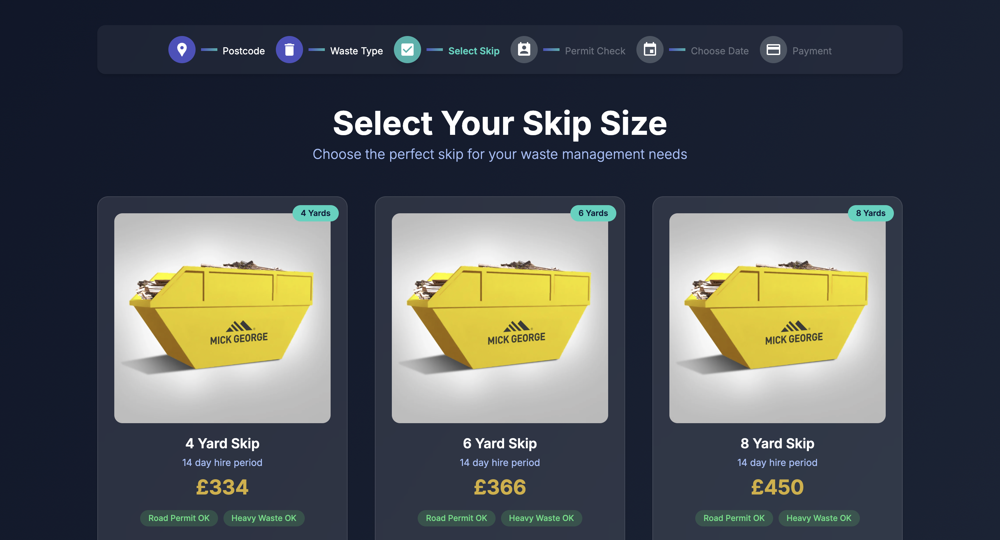
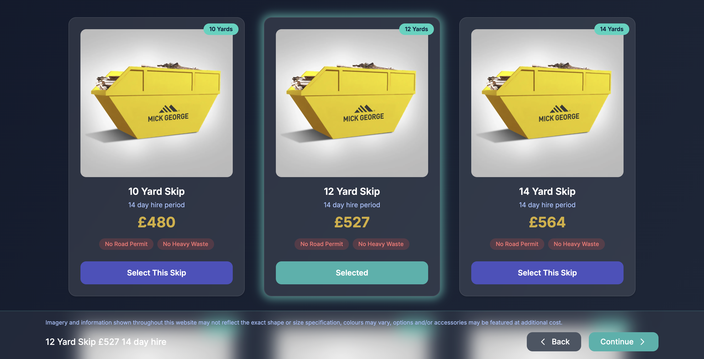

# Select-Skip 🚛♻️

A modern, user-friendly web page built with **React** and **Tailwind CSS** as a redesign of the "Choose Your Skip Size" page from [We Want Waste](https://wewantwaste.co.uk/).  
This project was created as part of a coding challenge to enhance the original page's interface while maintaining its core functionality of displaying skip options based on API data.

---

## 📚 Table of Contents

- [Overview](#overview)
- [Features](#features)
- [Technologies Used](#technologies-used)
- [Installation](#installation)
- [Usage](#usage)
- [Contact](#contact)

---

## 🔍 Overview

**Select-Skip** reimagines the skip selection process from the We Want Waste website, focusing on a **clean**, **responsive**, and **modern** design.  
It fetches real-time skip data from an API and presents it using an intuitive layout. This redesign emphasizes **maintainable React code**, **enhanced UI/UX**, and **full responsiveness** for both desktop and mobile users.
### 🖼️ Screenshots

**Default Skip Selection View:**



**After Selecting a Skip (Sticky Footer Appears):**



---

## ✨ Features

- ✅ **Step Indicator** – Highlights the current step ("Select Skip") with a progress bar.
- 📦 **Responsive Skip Cards** – Display skip details (size, price, hire period, road permit compatibility, heavy waste).
- 🖱️ **Interactive Selection** – Users can select a skip with a glow animation for visual feedback.
- 📌 **Sticky Confirmation** – Selected skip details shown in a sticky footer.
- 🎨 **Modern Design** – Glassmorphic UI with Tailwind CSS and gradient backgrounds.
- 📱 **Responsive Layout** – Optimized for all screen sizes with scrollable step indicator on mobile.
- 🧠 **Custom Title** – Updates browser tab to `Skip Selection - Waste Management`.

---

## 🛠️ Technologies Used

- ⚛️ **React** – Frontend library
- 🎨 **Tailwind CSS** – Utility-first CSS framework
- 🔤 **React Icons** – Icons for the step indicator
- ⚡ **Vite** – Lightning-fast development and build tool

---

## 🚀 Installation

To run this project locally, follow these steps:

1. **Clone the Repository:**
   ```bash
   git clone https://github.com/amine-ben-k/Select-Skip.git
   cd Select-Skip
2. **Install Dependencies:**
   Ensure Node.js is installed and then run:
   ```bash
   npm install
3. **Run the Development Server:**
   ```bash
   npm run dev
  Open your browser and navigate to:
  http://localhost:5173
## 💡 Usage

### 1. Open the Website
- Navigate to [http://localhost:5173](http://localhost:5173) after starting the development server.

### 2. Select a Skip
- View the **step indicator** at the top.
- Browse the available **skips** in a grid layout.
- Click **"Select This Skip"** on any skip card to choose it.
- Upon selection:
  - The card will **glow** for visual feedback.
  - A **sticky footer** will appear showing the selected skip’s:
    - ✅ Size  
    - 💰 Price
## 📬 Contact

For questions or feedback, feel free to reach out:

- 🔗 **GitHub**: [amine-ben-k](https://github.com/amine-ben-k)  
- 📧 **Email**: [amine.bky@yahoo.com](mailto:amine.bky@yahoo.com)

---

Thank you for checking out **Select-Skip!** 🚀  
This project was submitted as part of a coding challenge.


